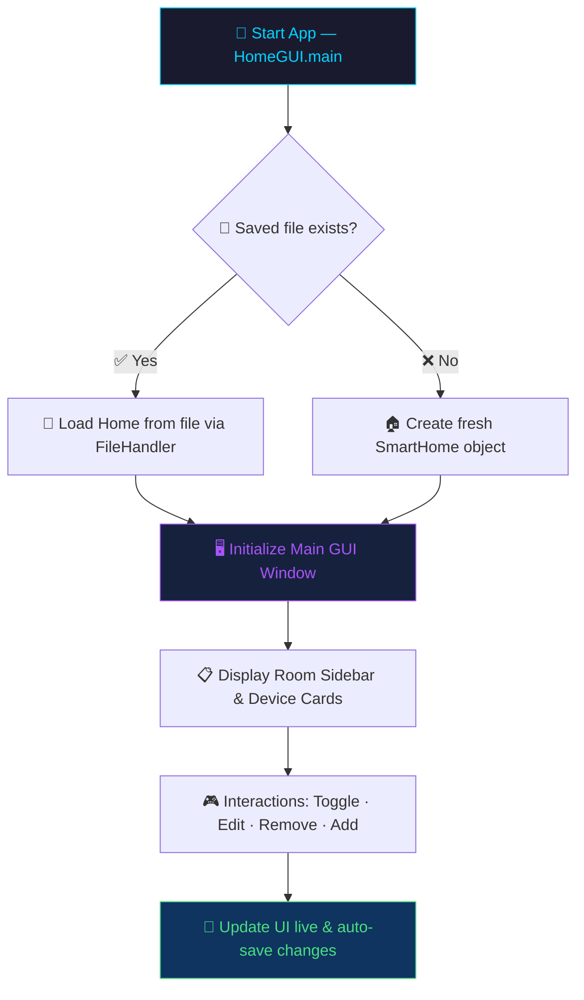

<div align="center">

# 🏠 Smart Home Manager
### Java OOP Desktop App | Glassmorphic Swing UI

<br/>


<br/>

> **A sleek, glassmorphic Java Swing desktop application for managing smart home devices — built as a deep dive into Object-Oriented Programming.**

<br/>

[📌 Overview](#-overview) • [🏗️ Architecture](#️-architecture) • [🧠 OOP Principles](#-oop-design-principles) • [🎮 Features](#-features) • [💾 File Persistence](#-file-persistence-model) • [🚀 Getting Started](#-getting-started)

---

</div>

## 📌 Overview

**Smart Home Manager** is a Java desktop application built with **Java Swing** that simulates a real-world smart home control panel. Users can add, monitor, and control smart devices like lights, fans, air conditioners, and security cameras — all through a visually polished, glassmorphic interface.

This project demonstrates all **four pillars of OOP** in a practical, working application context.

```
📂 Smart Home Manager
├── 💡 Smart Lights        — control brightness
├── 🌀 Smart Fans          — adjust fan speed (1–5)
├── ❄️  Air Conditioners    — set temperature & mode
└── 📷 Security Cameras    — toggle video recording
```

---

## 🏗️ Architecture



<br/>

### 📁 Project Structure

```
src/tanisha/
│
├── 📄 SmartDevice.java       ← Abstract base class (Abstraction + Encapsulation)
├── 💡 Light.java             ← Smart light with brightness control
├── 🌀 Fan.java               ← Smart fan with speed settings (1–5)
├── ❄️  AirConditioner.java   ← AC with temperature & mode config
├── 📷 SecurityCamera.java    ← Security camera with recording toggle
├── 🏠 SmartHome.java         ← Container: stores, filters & manages devices
├── 💾 FileHandler.java       ← Reads/writes home state to disk
└── 🖥️ HomeGUI.java          ← Main Swing UI — layouts, cards, event logic
```

---

## 🧠 OOP Design Principles

This project is a complete, real-world application of all four OOP pillars:

<br/>

### 🔷 1. Abstraction
> *Hide complexity. Show only what matters.*

[`SmartDevice.java`](src/tanisha/SmartDevice.java) is an **abstract class** that defines a clean template every device must follow, without exposing internal complexity:

```java
public abstract String operate();   // What does the device do when ON?
public abstract String getStatus(); // What's the device's current state?
public abstract String getType();   // "Light" | "Fan" | "AC" | "Camera"
```
Each concrete device implements these differently — enforced at compile time.

<br/>

### 🔷 2. Encapsulation
> *Private data. Controlled access. Validated updates.*

Fields in every class are kept `private` — only accessible through safe getters/setters:

```java
// In Fan.java — setter with built-in validation
public void setSpeed(int speed) {
    if (speed >= 1 && speed <= 5)
        this.speed = speed;  // Only valid range 1–5 accepted
}
```

| Class | Private Fields |
|---|---|
| `SmartDevice` | `deviceId`, `name`, `room`, `isOn` |
| `Light` | `brightness` (0–100%) |
| `Fan` | `speed` (1–5) |
| `AirConditioner` | `temperature`, `mode` |
| `SecurityCamera` | `isRecording` |

<br/>

### 🔷 3. Inheritance
> *Write once. Extend everywhere.*

All device classes inherit common behavior from [`SmartDevice`](src/tanisha/SmartDevice.java) using the `extends` keyword — eliminating code duplication for shared fields and methods:

```
SmartDevice  (abstract)
    ├── Light
    ├── Fan
    ├── AirConditioner
    └── SecurityCamera
```

Shared behaviour like `turnOn()`, `turnOff()`, `toggle()`, `getName()`, `getRoom()` is written **once** and reused by all four device types.

<br/>

### 🔷 4. Polymorphism
> *One interface. Many forms.*

Devices are stored in a **generic list** and processed with a **single loop**:

```java
// In SmartHome.java
ArrayList<SmartDevice> devices = new ArrayList<>();

// In HomeGUI.java — one loop, multiple behaviors at runtime
for (SmartDevice device : devices) {
    buildCard(device);          // calls device.getType()
    showStatus(device);         // calls device.getStatus()
}
```

The JVM decides at **runtime** which overridden `getStatus()` or `getType()` to call — true polymorphism in action.

---

## 🎮 Features

| Feature | Description |
|---|---|
| 🏠 **Multi-Room View** | Filter and browse devices by room via dynamic sidebar |
| ⚡ **Live Toggle** | Toggle any device ON/OFF — UI updates instantly |
| 🎚️ **Device Controls** | Adjust brightness, fan speed, AC temperature & mode |
| ➕ **Add Devices** | Create new devices with custom names and room assignments |
| 🗑️ **Remove Devices** | Delete devices cleanly with state sync |
| 💾 **Auto-Save** | Every change is persisted to `data/home_data.txt` automatically |
| 📊 **Live Stats** | Header panel shows real-time count of total and active devices |
| 🎨 **Glassmorphic UI** | Custom-styled Swing components with a modern dark aesthetic |

---

## 💾 File Persistence Model

[`FileHandler.java`](src/tanisha/FileHandler.java) handles reading and writing the entire home state to `data/home_data.txt` using a simple, pipe-delimited format:

### 📄 Save File Format

```
HOME|My Smart Home
LIGHT|L101|Ceiling Light|Living Room|true|80
FAN|F102|Ceiling Fan|Bedroom|false|3
AC|AC103|Cooling Unit|Garage|true|22.0|Cool
CAMERA|C104|Front Door Camera|Outdoor|true|true
```

| Segment | Meaning |
|---|---|
| `HOME\|...` | The home's display name |
| `LIGHT\|ID\|Name\|Room\|isOn\|brightness` | A light device entry |
| `FAN\|ID\|Name\|Room\|isOn\|speed` | A fan device entry |
| `AC\|ID\|Name\|Room\|isOn\|temp\|mode` | An AC device entry |
| `CAMERA\|ID\|Name\|Room\|isOn\|isRecording` | A camera device entry |

### 🔄 Loading Logic

```java
String[] parts = line.split("\\|");
switch (parts[0]) {
    case "LIGHT"  -> devices.add(new Light(...));
    case "FAN"    -> devices.add(new Fan(...));
    case "AC"     -> devices.add(new AirConditioner(...));
    case "CAMERA" -> devices.add(new SecurityCamera(...));
}
```

---

## 🚀 Getting Started

### Prerequisites

- ☕ **Java Development Kit (JDK 8+)** — [Download here](https://www.oracle.com/java/technologies/downloads/)
- Any Java IDE (NetBeans, IntelliJ IDEA, Eclipse) **or** command line

<br/>

### ▶️ Run via Command Line

```bash
# 1. Navigate to the project root
cd path/to/smart-home-manager

# 2. Compile all source files
javac -d build/classes src/tanisha/*.java

# 3. Run the application
java -cp build/classes tanisha.HomeGUI
```

### ▶️ Run via NetBeans / IntelliJ

1. Open the project folder as an existing project
2. Set `HomeGUI.java` as the **main class**
3. Click **Run** ▶️

---

<div align="center">

---

### 🛠️ Built With

**Java** • **Java Swing** • **OOP Design Patterns** • **File I/O**

<br/>

*Made with ❤️ as an OOP course project — demonstrating that clean architecture and beautiful UI can coexist.*

<br/>


</div>
