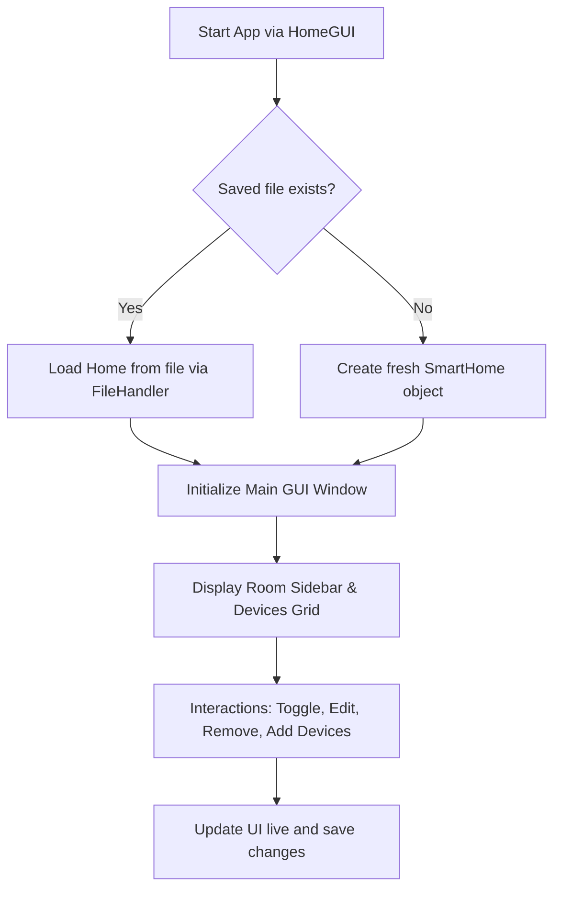

# Smart Home Manager - Project Documentation

This project is a Java Swing-based desktop application for managing smart home devices. It illustrates the application of Object-Oriented Programming (OOP) concepts in Java, including **Abstraction, Encapsulation, Inheritance, and Polymorphism**, wrapped in a sleek, glassmorphic GUI.

---

## Table of Contents
1. [Project Structure](#project-structure)
2. [OOP Design Principles](#oop-design-principles)
3. [App Components & Flow](#app-components--flow)
4. [File Persistence Model](#file-persistence-model)
5. [How to Run the Project](#how-to-run-the-project)

---

## Project Structure

All source code files are located in the `src/tanisha/` package:

- [SmartDevice.java](file:///c:/Users/DELL/OneDrive/Desktop/tanisha/src/tanisha/SmartDevice.java) - Abstract base class defining common fields and methods.
- [Light.java](file:///c:/Users/DELL/OneDrive/Desktop/tanisha/src/tanisha/Light.java) - Child class representing a smart light with brightness settings.
- [Fan.java](file:///c:/Users/DELL/OneDrive/Desktop/tanisha/src/tanisha/Fan.java) - Child class representing a smart fan with speed settings.
- [AirConditioner.java](file:///c:/Users/DELL/OneDrive/Desktop/tanisha/src/tanisha/AirConditioner.java) - Child class representing a smart air conditioner with temperature and mode configurations.
- [SecurityCamera.java](file:///c:/Users/DELL/OneDrive/Desktop/tanisha/src/tanisha/SecurityCamera.java) - Child class representing a security camera with video recording toggle.
- [SmartHome.java](file:///c:/Users/DELL/OneDrive/Desktop/tanisha/src/tanisha/SmartHome.java) - Container class to store, filter, and modify devices.
- [FileHandler.java](file:///c:/Users/DELL/OneDrive/Desktop/tanisha/src/tanisha/FileHandler.java) - Utility class for loading/saving home data from/to a text file.
- [HomeGUI.java](file:///c:/Users/DELL/OneDrive/Desktop/tanisha/src/tanisha/HomeGUI.java) - The Swing main application file containing GUI layouts, custom glass components, and event handling logic.

---

## OOP Design Principles

### 1. Abstraction
Defined in [SmartDevice](file:///c:/Users/DELL/OneDrive/Desktop/tanisha/src/tanisha/SmartDevice.java), this abstract class hides complex operations and establishes a template for concrete devices:
- Abstract methods like [operate()](file:///c:/Users/DELL/OneDrive/Desktop/tanisha/src/tanisha/SmartDevice.java#L43) and [getStatus()](file:///c:/Users/DELL/OneDrive/Desktop/tanisha/src/tanisha/SmartDevice.java#L44) must be implemented by each child class to describe what it does when turned ON or OFF.

### 2. Encapsulation
Data is kept secure and hidden using `private` variables:
- Fields such as `deviceId`, `name`, `room`, and `isOn` can only be read/updated through public getters and setters.
- Setters perform input validation (e.g., ensuring speed stays between 1 and 5 in [Fan.setSpeed(int)](file:///c:/Users/DELL/OneDrive/Desktop/tanisha/src/tanisha/Fan.java#L19-L23)).

### 3. Inheritance
The child classes ([Light](file:///c:/Users/DELL/OneDrive/Desktop/tanisha/src/tanisha/Light.java), [Fan](file:///c:/Users/DELL/OneDrive/Desktop/tanisha/src/tanisha/Fan.java), [AirConditioner](file:///c:/Users/DELL/OneDrive/Desktop/tanisha/src/tanisha/AirConditioner.java), [SecurityCamera](file:///c:/Users/DELL/OneDrive/Desktop/tanisha/src/tanisha/SecurityCamera.java)) inherit code from [SmartDevice](file:///c:/Users/DELL/OneDrive/Desktop/tanisha/src/tanisha/SmartDevice.java) using the `extends` keyword. This eliminates duplicate code for shared properties.

### 4. Polymorphism
Polymorphism is used throughout the codebase:
- In [SmartHome.java](file:///c:/Users/DELL/OneDrive/Desktop/tanisha/src/tanisha/SmartHome.java), devices are managed inside a generic list: `ArrayList<SmartDevice>`.
- In [HomeGUI.java](file:///c:/Users/DELL/OneDrive/Desktop/tanisha/src/tanisha/HomeGUI.java), a single loop iterates over `SmartDevice` elements and builds cards dynamically. The system invokes different overrides for [getType()](file:///c:/Users/DELL/OneDrive/Desktop/tanisha/src/tanisha/SmartDevice.java#L45) or [getStatus()](file:///c:/Users/DELL/OneDrive/Desktop/tanisha/src/tanisha/SmartDevice.java#L44) depending on what type of device object it is evaluating at runtime.

---

## App Components & Flow



### 1. Initialization
When [HomeGUI.main(String[])](file:///c:/Users/DELL/OneDrive/Desktop/tanisha/src/tanisha/HomeGUI.java#L52-L57) is launched:
- The custom colors and styling are configured for the swing popups.
- It calls [FileHandler.hasSavedFile()](file:///c:/Users/DELL/OneDrive/Desktop/tanisha/src/tanisha/FileHandler.java#L130-L132) to prompt the user if they'd like to load saved data.

### 2. Main Layout Structure
- **Header Panel**: Shows the home name and live statistics (e.g., "Total: 5 devices | Active: 2 ON").
- **Sidebar Panel**: Filters devices by room. A unique room list is fetched dynamically using [SmartHome.getRooms()](file:///c:/Users/DELL/OneDrive/Desktop/tanisha/src/tanisha/SmartHome.java#L66-L74).
- **Card Grid Panel**: Displays a scrollable pane populated with `DeviceCardPanel` units corresponding to the filtered room selection.

### 3. Device Controls
- Toggling the primary switch updates the state of the device and re-renders the card (inactive controls like sliders are grayed out when off).
- Custom controllers let users adjust brightness (for Light), speed (for Fan), or temperature / modes (for AC) on the fly.

---

## File Persistence Model

[FileHandler.java](file:///c:/Users/DELL/OneDrive/Desktop/tanisha/src/tanisha/FileHandler.java) handles reading and writing configurations from/to `data/home_data.txt`.

### Save File Format
The first line stores the name of the home. Subsequent lines store the serialized data of each device separated by the `|` symbol:
```text
HOME|My Smart Home
LIGHT|L101|Ceiling Light|Living Room|true|80
FAN|F102|Ceiling Fan|Bedroom|false|3
AC|AC103|Cooling Unit|Garage|true|22.0|Cool
CAMERA|C104|Front Door Camera|Outdoor|true|true
```

### Loading Logic
When parsing:
- It splits each line using `line.split("\\|")`.
- It reads the first segment (e.g., `LIGHT`, `FAN`, `AC`, `CAMERA`) and initializes the appropriate subclass constructor before restoring state variables and inserting it into the [SmartHome](file:///c:/Users/DELL/OneDrive/Desktop/tanisha/src/tanisha/SmartHome.java) instance.

---

## How to Run the Project

1. Ensure you have the **Java Development Kit (JDK 8 or higher)** installed on your machine.
2. Compile all java files inside the `src/tanisha/` folder.
3. Execute the [HomeGUI](file:///c:/Users/DELL/OneDrive/Desktop/tanisha/src/tanisha/HomeGUI.java) class as the entry point of the project.
